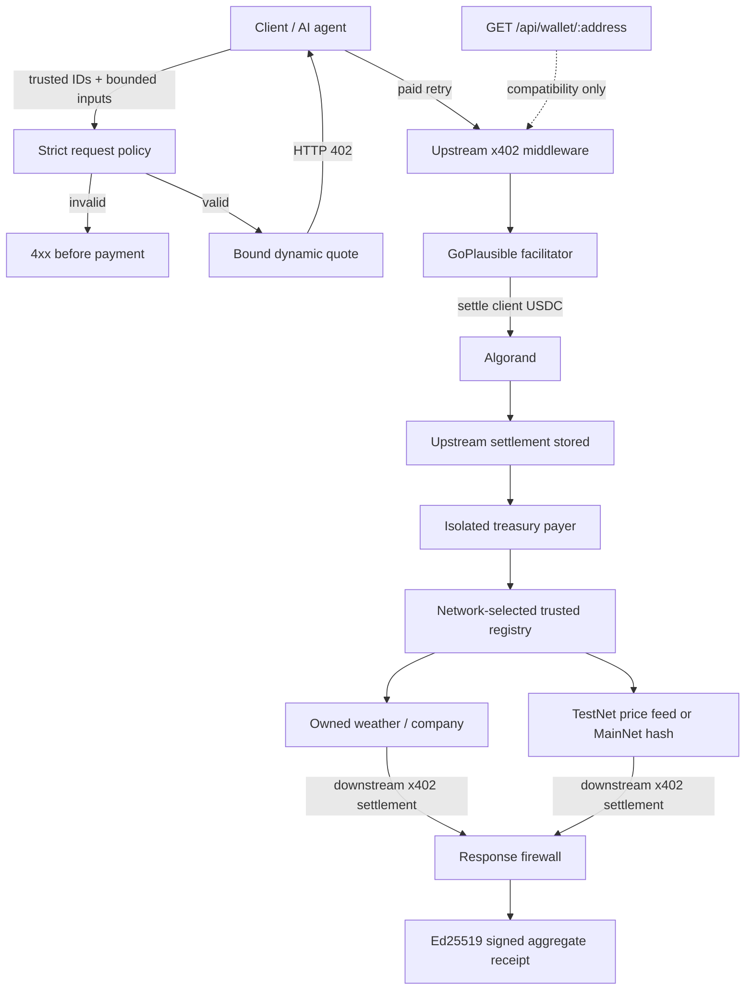

# CPMM-SHIELD Orchestrator Architecture

CPMM-SHIELD is an x402 Orchestrator. Its primary paid route is `POST /api/shield/execute`: a client pays the shield once, the shield confirms upstream settlement, then an isolated treasury pays only network-appropriate trusted downstream resources. Settled responses pass the response firewall before one signed aggregate receipt is returned.

## Primary request boundary

The public shield request contains only a request ID and up to three resource selections with provider-specific input, a payment ceiling, and a required flag. Clients cannot supply provider URLs, recipients, networks, assets, request/response schemas, or treasury credentials.

The policy and quote layer runs before x402 middleware. Malformed input, unsupported provider algorithms, wrong-network resource IDs, duplicate resources, and budget violations therefore fail before a payment challenge.

## Two settlement boundaries

The upstream and downstream payments are independent:

1. The client receives the shield's bound 402, signs, retries, and must obtain confirmed upstream settlement.
2. Only after that settlement is stored may the isolated treasury call downstream resources.
3. Each downstream payment requirement must match the runtime Algorand network, USDC ASA, exact trusted amount, and pinned recipient before signing.
4. Each downstream HTTP response must include successful settlement evidence. HTTP 200 alone is insufficient.

## Network-selected providers

The active registry always contains three owned demo resources plus one curated external provider:

| Runtime network | External provider | Request |
| --- | --- | --- |
| TestNet | `external-algo-price` | `GET https://recourse-api-production.up.railway.app/feed/compliant`, exact `{}` input |
| MainNet | `external-hash` | `POST https://agent402.tools/api/hash`, exact `{ text, algo }` input |

The inactive external ID is absent and rejected before payment. Owned resource payloads are labeled simulated content; the independently hosted result is labeled provider content.

## Response firewall and receipt

Downstream redirects, non-success responses, missing settlement receipts, non-JSON/oversized/malformed bodies, exact-schema violations, and narrow blocked instruction markers are rejected. Settled spend remains visible even when content validation fails. Valid results and per-resource payment outcomes are aggregated into an Ed25519-signed receipt.

## Discovery and legacy compatibility

Bazaar metadata describes `POST /api/shield/execute`, but discovery never authorizes treasury spending. A provider becomes payable only through explicit curated configuration.

`GET /api/wallet/:address` remains a legacy starter-template example. Its single wallet-data payment can test basic x402 compatibility, but it is not the CPMM-SHIELD Orchestrator flow or acceptable Orchestrator settlement evidence.

## MainNet boundary

MainNet uses real funds and never permits server-side demo payer mode. MainNet success requires secure signer custody, deliberate funding and USDC opt-ins, successful upstream and downstream settlement receipts, and independent on-chain confirmation. Registry presence, simulation, structural smoke, and an unpaid 402 are not settlement evidence.
