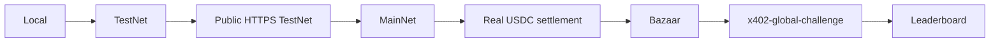

# TestNet to Global x402 Challenge

This guide reflects the Algorand Foundation's current Challenge page and implementation guide checked on August 14, 2026. Re-check the [official Challenge page](https://algorand.co/global-x402-challenge) before submitting because dates and forms can change.



## 1. Local

Run the health, invalid-address, and unpaid demonstrations. Local proves the server and x402 challenge work, but other agents cannot reliably call `localhost`.

```bash
pnpm build
pnpm test
pnpm dev
pnpm client:unpaid
```

## 2. TestNet

Use:

```env
ALGORAND_NETWORK=testnet
PAY_TO_ADDRESS=TESTNET_RECEIVER
CHALLENGE_MODE=false
```

The selected values are the full TestNet network reference and USDC ASA `10458941`. Complete a real TestNet pay → verify → settle → response cycle. TestNet does not count toward the Challenge leaderboard.

## 3. Public HTTPS TestNet

Deploy before spending real money. Set `API_BASE_URL` to the public origin and rerun unpaid/paid clients. Verify that proxy/CDN configuration preserves `PAYMENT-REQUIRED`, `PAYMENT-SIGNATURE`, and `PAYMENT-RESPONSE` headers.

## 4. MainNet

Change:

```env
ALGORAND_NETWORK=mainnet
PAY_TO_ADDRESS=MAINNET_RECEIVER_OPTED_INTO_USDC
API_BASE_URL=https://your-domain.example
CHALLENGE_MODE=true
```

The code chooses MainNet USDC ASA `31566704`; the facilitator URL stays the same. The payer and receiver must be MainNet accounts. Transactions use real ALGO and USDC.

CPMM-SHIELD exposes `external-hash` on MainNet and removes the TestNet-only `external-algo-price` ID from the trusted registry. Do not enable MainNet orchestration until buyer and treasury signing use an explicitly secure custody path, the intended accounts are deliberately funded and opted into USDC, and the team is prepared to verify real settlement evidence. `DEMO_MODE=true` remains prohibited on MainNet.

Use one `payTo` consistently for x402 Commerce Template on its one root domain. Current Challenge guidance says not to reuse one merchant account across different root domains.

## 5. Real USDC Settlement

Run `pnpm client:paid` against the public MainNet URL. Require all three proofs:

1. paid JSON response;
2. successful x402 settlement receipt and confirmed transaction;
3. USDC received by `PAY_TO_ADDRESS`.

Do not call an attempted or merely verified payment “settled.”

## 6. Bazaar

The server already registers the extension and route discovery declaration. A successful settlement carries that metadata to GoPlausible. Confirm the public route in the [resource catalog](https://facilitator.goplausible.xyz/dashboard/leaderboards?cat=resources) and the receiver in the [merchant catalog](https://facilitator.goplausible.xyz/dashboard/leaderboards?cat=merchants).

## 7. Challenge Tag

`CHALLENGE_MODE=true` adds this field to the payment requirement's `extra` object:

```json
{
  "tag": "x402-global-challenge"
}
```

Keep it off for ordinary demo traffic so the distinction is visible.

## 8. Leaderboard and Submission

Use the GoPlausible dashboard with the Global Challenge filter enabled. The current Challenge page defines Standard, Composite, and Orchestrator entries. CPMM-SHIELD is an **Orchestrator entry** because one paid shield request coordinates three downstream x402 resources through an isolated treasury and returns one validated signed receipt.

The deterministic TestNet flow requests owned weather (2000 atomic), owned company lookup (3000 atomic), and independently hosted `external-algo-price` (1000 atomic), plus the 1000-atomic shield fee for a 0.007000-USDC quote. MainNet selects independently hosted `external-hash` instead. Registry presence, simulation, or unpaid challenges do not prove live settlement.

Leaderboard ranking depends on real on-chain usage, not the number of local requests. Submit through the current official Challenge page and keep evidence of the endpoint, payment unlock, settlement, and genuine users.

## Final Checklist

- [ ] `/health` is public and the wallet route returns an unpaid `402`
- [ ] Full TestNet payment/settlement/paid-response flow works
- [ ] Endpoint is deployed to a public HTTPS domain
- [ ] `ALGORAND_NETWORK=mainnet`
- [ ] Active registry contains `external-hash` and excludes `external-algo-price`
- [ ] MainNet USDC ASA is `31566704`
- [ ] Buyer and treasury use an approved secure MainNet signer/custody path
- [ ] Accounts are deliberately funded and opted into the intended MainNet USDC asset
- [ ] MainNet `payTo` is opted into USDC
- [ ] GoPlausible is the configured facilitator
- [ ] Bazaar extension and valid route metadata are enabled
- [ ] `CHALLENGE_MODE=true` adds `x402-global-challenge`
- [ ] One real MainNet payment has settled
- [ ] Paid response and successful settlement receipt were received
- [ ] Transaction is confirmed and USDC reached `payTo`
- [ ] Resource is visible in Bazaar
- [ ] Merchant entry is keyed to the intended `payTo`
- [ ] Activity is visible with the Global Challenge leaderboard filter
- [ ] Project has been submitted through the current official form
- [ ] Genuine usage continues through the measurement period

## Current Official Sources

- [Global x402 Challenge](https://algorand.co/global-x402-challenge)
- [How to build and submit an entry](https://algorand.co/blog/the-x402-global-challenge-is-live-how-to-build-submit-your-entry)
- [x402 on Algorand implementation tutorial](https://dev.algorand.co/resources/x402-on-algorand/)
- [GoPlausible dashboard](https://facilitator.goplausible.xyz/dashboard/)
